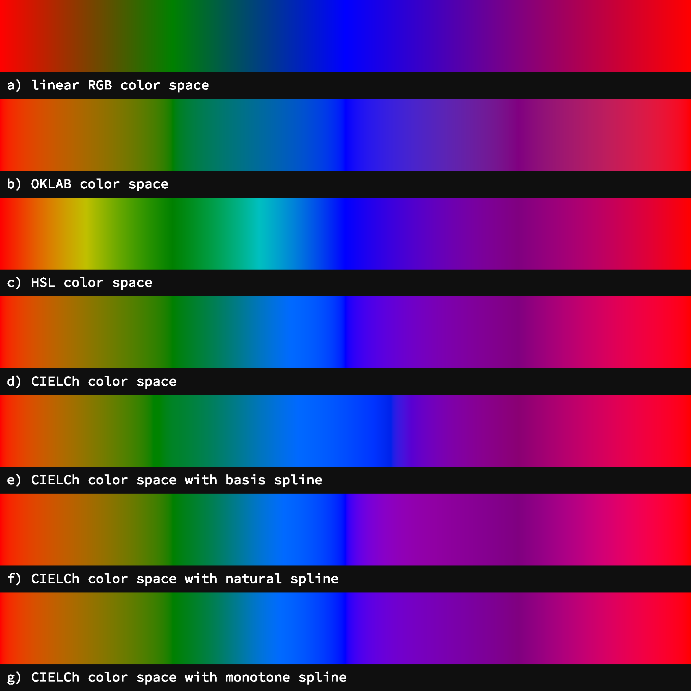

# Generative Everday

An ongoing project to try to create new generative art experiment(s) each day.

### Resources

#### Tooling

- [`canvas-sketch`](https://github.com/mattdesl/canvas-sketch) framework by [Matt DesLauriers](https://mattdesl.com/)

#### References

- [Creative coding algorithms & techniques](https://www.notion.so/Creative-coding-algorithms-techniques-c5550ef2f7574126bdc77b09ed76651b)
- [Color arrangement in generative art](https://tylerxhobbs.com/essays/2021/color-arrangement-in-generative-art)

#### Inspiration

- [Neon dithering](https://bayfragile.com/category/hen-x912wy/)

### Contents

- [0000](#0000)
- [0001](#0001)
- [0002](#0002)

## 0000

#### Basic Grid

- [multi-dimensional array of UV coordinates](https://github.com/mattdesl/workshop-generative-art/blob/master/docs/cheat-sheet.md#grids--uv-coordinates)
- mapped to pixel values with [linear interpolation](https://github.com/mattdesl/workshop-generative-art/blob/master/docs/cheat-sheet.md#padding-with-margins-using-linear-interpolation).

#### Random Grid

- Uses [Random with a Seeds](https://github.com/mattdesl/canvas-sketch-util/blob/master/docs/random.md) technique to allow reproduceable randomness

```js
// You can force a specific seed by replacing this with a string value
const defaultSeed = "";
// Set a random seed so we can reproduce this print later
random.setSeed(defaultSeed || random.getRandomSeed());
// Print to console so we can see which seed is being used and copy it if desired
console.log("Random Seed:", random.getSeed());
```

<a href="https://github.com/xoxoxoxoxoxox/generative-everday/blob/master/0000/src/01-basic-grid.js"></a><a href="https://github.com/xoxoxoxoxoxox/generative-everday/blob/master/0000/src/02-random-grid.js"></a>

## 0001

#### Random Colors

- Uses [Nice color palettes](https://github.com/Jam3/nice-color-palettes) to randomly pick a complimentary palette

```js
let palette = random.pick(palettes);
palette = random.shuffle(palette);
palette = palette.slice(0, random.rangeFloor(3, palette.length + 1));
console.log('Palette: %s', JSON.stringify(palette));
```

<a href="https://github.com/xoxoxoxoxoxox/generative-everday/blob/master/0001/src/01-random-colors.js"></a>

#### Alternating shapes

- using methods to draw different shapes

<a href="https://github.com/xoxoxoxoxoxox/generative-everday/blob/master/0001/src/02-alternating-shapes.js"></a>


## 0002

#### Blending Colors

- Uses [color interpolate](https://github.com/colorjs/color-interpolate)

<a href="https://github.com/xoxoxoxoxoxox/generative-everday/blob/master/0002/src/01-blending-colors.js"></a>

#### Circle Packing

- Uses [pack spheres](https://github.com/mattdesl/pack-spheres)
- [Circle packing](https://generativeartistry.com/tutorials/circle-packing/)
- [Random circle packing](http://jdobr.es/blog/algorithmic-art-circle-pack/#)

<a href="https://github.com/xoxoxoxoxoxox/generative-everday/blob/master/0002/src/02-circle-packing.js"></a><a href="https://github.com/xoxoxoxoxoxox/generative-everday/blob/master/0002/src/03-circle-packing-round.js"></a>


## 0003

### Blending Color Space

- Uses [Colori](https://culorijs.org/) for interpolation and color spaces
- Uses [Nice color palettes](https://github.com/Jam3/nice-color-palettes) to test color space interpolation with different color palettes

<a href="https://github.com/xoxoxoxoxoxox/generative-everday/blob/master/0003/src/01-blending-color-space.js"></a><a href="https://github.com/xoxoxoxoxoxox/generative-everday/blob/master/0003/src/01-blending-color-space-palettes.js"></a>

# Future ideas

### Continue from 0002 Blending Colors

- look into replacing library with custom code
- [Perceptually Smooth Multi-Color Linear Gradients](https://observablehq.com/@mattdesl/perceptually-smooth-multi-color-linear-gradients)
- [Spline Gradient by @mattdesl](https://gist.github.com/mattdesl/2a7b2013492cbcbafc797d3f9164e92c)

- [Flow fields](https://www.bit-101.com/blog/2017/10/flow-fields-part-i/)
- [2d vector fields](https://muffinman.io/blog/neon-generative-art-piece-made-using-2d-vector-field/)

- [Watercolor Effects](https://tylerxhobbs.com/essays/2020/how-to-hack-a-painting)
- [Delaunay Triangulation](https://en.wikipedia.org/wiki/Delaunay_triangulation)